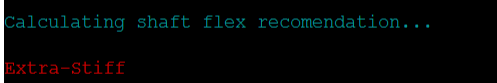
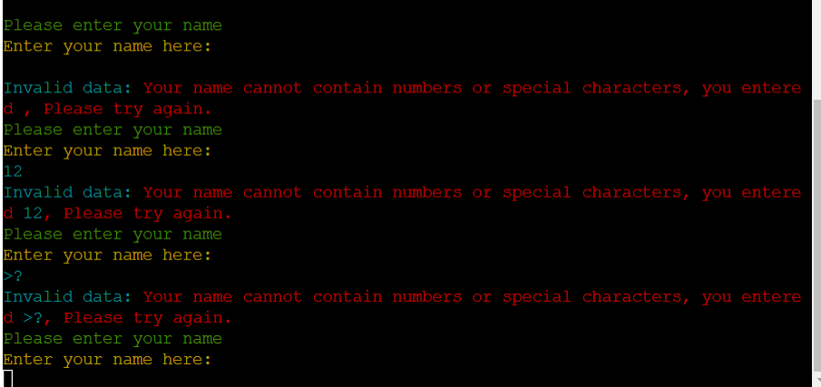
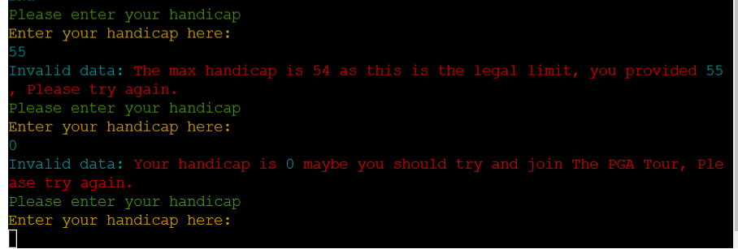

# DEEDEE'S CLUB-SHAFT-FITTER

DEEDEE's fitting app is used for keen golfers to enter data that they know about their game and be able to get accurate results on what clubs (irons) and what flex of shaft they should be using.

[Here is a live link to the app](https://deedees-fitting-app.herokuapp.com/)

## How to use the app

The app is designed to take information from the user and then give a recommendation on what type of clubs the should be using anf what type of shaft the should use with the club. The app will ask the user a series of questions and then make some calculations based on the information given and the make recommendations based on the calculations.

## Features
* The app features a series of questions that include: 
    * User's Name
    * User's handicap
    * Distance of the user's pitching wedge
    * Distance of the user's 6 Iron
    * Distance of the user's Driver

* The app take's driver distance and can work out clubhead speed by dividing the data by (2.5). Based on the player's clubhead speed the app will recommend a shaft flex which is suited to them. The flex will be either Regular, Stiff or Extra-Stiff.

## Testing

I have manually yesyed this project by doing the following:
* Passed the code through a PEP8 linter and confirmed there are...

* Given invalid inputs when asked for user's name:
    * Entered nothing when name was reuested
    * Entered numbers when the name was requested e.g(12345678890)
    * Entered special characters when the name was requested e.g(,.<>/?\|;:@'[]{})
* Each time an invalid input was entered into the Name request I expected to see an Error message to say that name couldn't be entered and this is what I seen.

* Given invalid inputs when asked for the User's Handicap:
    * Entered a value higher than 54
    * Entered a value lower than 1
* Both times I expected to see an Error messsage saying that it was an invalid data input:
    * Too high for values over 54
    * Too Low for values under 1

-----
Happy coding!